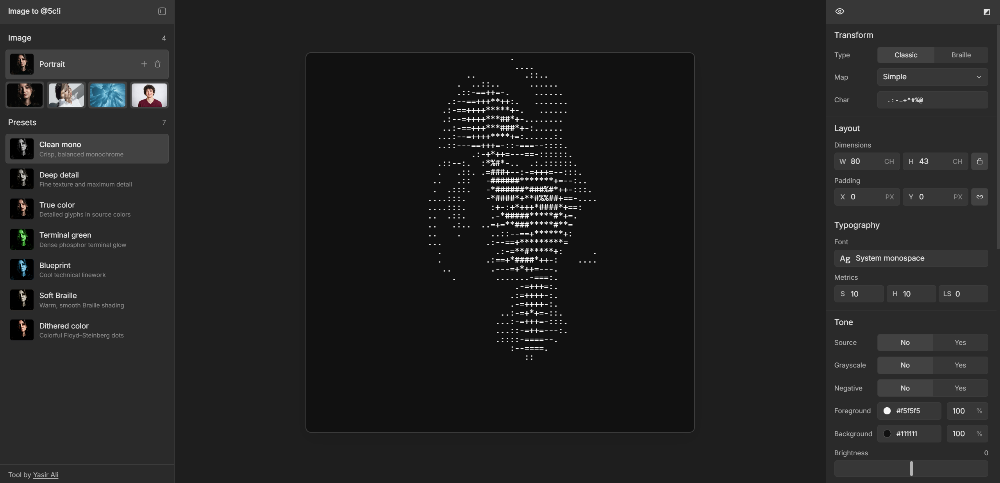

# Image to ascii

Convert images into customizable ASCII art in the browser.

## Run locally

1. `npm install`
2. `npm run dev`

## Build

Run `npm run build` to create the production files in `dist/`.
